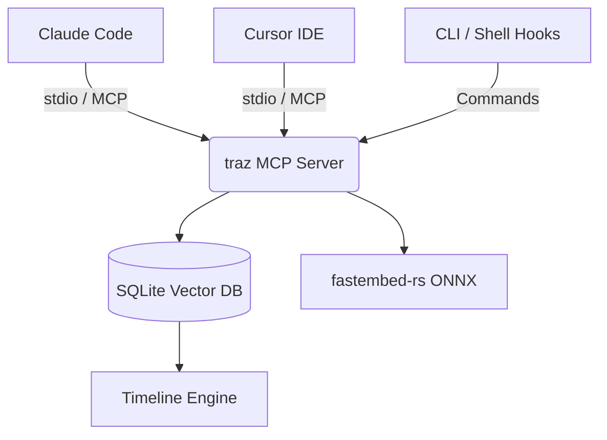

<p align="center">
  
</p>

<p align="center">
  <strong>Trace. Context. Continuity.</strong><br/>
  <sub>A local-first engineering memory layer and MCP server that provides AI coding tools with a shared, persistent context architecture.</sub>
</p>

<p align="center">
  <a href="https://github.com/mithilgirish/traz/blob/main/LICENSE"></a>
  
  
  
  <a href="https://traz.mithilgirish.dev"></a>
</p>

---

## Table of Contents
- [Overview](#overview)
- [The Context Fragmentation Problem](#the-context-fragmentation-problem)
- [Core Architecture & Design](#core-architecture--design)
- [Installation Guide](#installation-guide)
- [Initialization & Configuration](#initialization--configuration)
- [Command Line Interface Reference](#command-line-interface-reference)
  - [Ingestion Commands](#ingestion-commands)
  - [Exploration Commands](#exploration-commands)
  - [Maintenance Commands](#maintenance-commands)
- [Terminal User Interface (TUI)](#terminal-user-interface-tui)
- [Agent Integration (MCP)](#agent-integration-mcp)
  - [Supported AI Environments](#supported-ai-environments)
  - [Manual MCP Configuration](#manual-mcp-configuration)
- [Advanced Subsystems](#advanced-subsystems)
  - [Semantic Vector Search](#semantic-vector-search)
  - [Context Window Compression (Dense Format)](#context-window-compression-dense-format)
- [Security & Privacy](#security--privacy)
- [Troubleshooting & FAQ](#troubleshooting--faq)
- [Roadmap](#roadmap)
- [Contributing](#contributing)
- [License](#license)

---

## Overview

`traz` is a local-first engineering memory layer designed specifically for AI-augmented development. 

By capturing debugging history, architectural decisions, file modifications, and workflow traces as you code, `traz` establishes a highly searchable, persistent context timeline. This timeline is securely stored in a local SQLite vector database and automatically exposed via the **Model Context Protocol (MCP)**. This enables any compatible AI agent (Claude Code, Cursor, Aider, Gemini CLI, OpenAI Codex) to instantly synchronize context without manual developer intervention or copy-pasting.

## The Context Fragmentation Problem

Modern software development increasingly relies on multiple, specialized AI agents. A standard workflow might involve:
1. Triaging a stack trace in Claude Code.
2. Refactoring a dense component within Cursor IDE.
3. Generating unit tests via a terminal agent like Aider or Antigravity.

At every tool boundary, context is lost. The AI in the IDE does not inherently know what the AI in the terminal just fixed. Every new session starts as an isolated environment, forcing developers to manually rebuild the context window.

`traz` resolves this by acting as a persistent context plane. It ensures that subsequent AI sessions—regardless of the tool—inherit the context of previous decisions, mitigating context loss, reducing LLM token duplication, and preventing regression of thought.

## Core Architecture & Design

The `traz` architecture is built upon three primary pillars:

1. **Local Timeline Engine (SQLite):** A zero-dependency, local-first storage mechanism. It tracks event schemas across sessions, ensuring that proprietary source code and architectural context never leave the local machine. There are no cloud accounts, no sync delays, and no vendor lock-in.
2. **Hybrid Vector Search:** Leverages the `fastembed-rs` library to execute ONNX-accelerated embedding generation locally. It implements Reciprocal Rank Fusion (RRF) to intelligently merge exact keyword matches (FTS5) with semantic vector similarity, ensuring high-fidelity context retrieval even when vocabulary drifts.
3. **MCP Server Integration:** Implements the open Model Context Protocol to serve context transparently to supported AI agents. By utilizing an engineered "Dense Output Format," it compresses context payload sizes by up to 75%, preserving valuable context window capacity for the LLM's actual reasoning process.



For an in-depth review of the underlying schema, migration logic, and RRF mathematics, please refer to the [Architecture Documentation](./docs/ARCHITECTURE.md).

## Installation Guide

Select your preferred installation method:

### 1. Via NPM (Cross-Platform)
```bash
npm install -g traz
```

### 2. Via Homebrew (macOS & Linux)
```bash
brew tap mithilgirish/traz
brew install traz
```

### 3. Standalone Installers (No dependencies required)
* **macOS & Linux (Shell):**
  ```bash
  curl --proto '=https' --tlsv1.2 -LsSf https://github.com/mithilgirish/traz/releases/latest/download/traz-installer.sh | sh
  ```
* **Windows (PowerShell):**
  ```powershell
  irm https://github.com/mithilgirish/traz/releases/latest/download/traz-installer.ps1 | iex
  ```

### 4. Via Cargo (Build from source)
Requires the Rust toolchain (v1.75.0 or higher):
```bash
cargo install --git https://github.com/mithilgirish/traz.git traz
```

### Build from Source manually
For contributors or users requiring specific branch deployments:
```bash
git clone https://github.com/mithilgirish/traz.git
cd traz
cargo build --release

# Optional: Add to PATH systematically
sudo cp target/release/traz /usr/local/bin/
```

### Verification
Ensure the binary is correctly linked and the embedding model engine is accessible.
```bash
traz doctor
```

## Initialization & Configuration

Initialize `traz` within your repository to establish the local timeline directory (`.traz/`). This directory acts as the nexus for your project's history.

```bash
cd your-project
traz init
```

Running `traz init` performs the following automated steps:
1. Creates the `.traz/` local directory.
2. Initializes the SQLite schema (`traz.db`) and vector index.
3. Automatically appends `.traz/` to your `.gitignore` to prevent committing the database to remote version control.

## Command Line Interface Reference

The CLI is designed to be highly composable, scriptable for CI/CD integration, and readable for daily workflow monitoring.

### Ingestion Commands

**Log Manual Context:**
Append a manual note, architectural decision, or debugging trace directly to the timeline.
```bash
traz log "traced root cause of memory leak to unbounded queue growth in the worker pool"
```

**Add Structured Events:**
Useful for shell aliases or git hooks.
```bash
traz add --tool cursor --event-type bug_fix --title "Fixed auth race condition"
```

### Exploration Commands

**View Recent Activity:**
Fetch a chronological list of the most recent events across all tools.
```bash
$ traz recent --limit 5

[claude-code · 2h ago] fixed websocket reconnect issue
[cursor · 5h ago] updated auth middleware
[warp · 1d ago] traced memory leak in queue worker
[aider · 2d ago] reverted broken cache optimization
```

**Search Engineering History:**
Perform keyword searches against the timeline.
```bash
$ traz search auth

[2d ago] claude-code
Fixed JWT refresh race condition

[5h ago] cursor
Updated auth middleware retry logic
```

**View Workflow Timeline:**
Render a bulleted workflow trace of operations, useful for generating PR descriptions or commit summaries.
```bash
$ traz timeline

• created websocket handler
• debugged reconnect issue
• added retry backoff
• verified with local tests
```

**Time-Bounded AI Recap:**
Generate a time-bounded summary, commonly used for daily standups or morning synchronization.
```bash
$ traz recap --hours 24
```

### Maintenance Commands

**Context Checkpointing:**
Save a named snapshot of the current state. Useful when switching branches or finalizing a massive refactor.
```bash
traz checkpoint --message "completed auth migration"
```

**Backfill Embeddings:**
Generate missing vector embeddings for older events ingested prior to vector support or during offline periods.
```bash
traz backfill-embeddings
```

## Terminal User Interface (TUI)

For an interactive, visually structured view of the repository's history and AI traces, `traz` ships with a native TUI.

```bash
traz tui
```

The TUI provides:
- Split-pane navigation of historical checkpoints.
- Interactive filtering by AI tool, event type, or timestamp.
- Detailed inspection of specific debug logs or diffs associated with an event.

## Agent Integration (MCP)

`traz` acts as an MCP stdio server. It features auto-detecting setup workflows to register itself across major AI tools effortlessly.

### Supported AI Environments

Run the setup command corresponding to your primary tool. The wizard will automatically locate the tool's configuration file and inject the necessary MCP routing logic.

```bash
traz setup claude   # Configures Claude Code
traz setup cursor   # Modifies ~/.cursor/mcp.json
traz setup opencode # Configures OpenCode
traz setup codex    # Configures OpenAI Codex CLI
traz setup gemini   # Configures Gemini CLI
traz setup agy      # Configures Antigravity CLI
```

### Manual MCP Configuration

For tools not supported by the interactive wizard (such as Aider or custom agents), configure your agent to execute `traz` with the `mcp` subcommand.

**Example `mcp.json` structure:**
```json
{
  "mcpServers": {
    "traz": {
      "command": "traz",
      "args": ["mcp"]
    }
  }
}
```

Once configured, the AI tool will automatically query the `traz` server on initialization, retrieve the latest checkpoints, and restore context natively. For further details, refer to the [Agent Integration Guide](./docs/AGENT_INTEGRATION.md).

## Advanced Subsystems

### Semantic Vector Search

By default, `traz` generates local embeddings for all ingested events using an ONNX-accelerated MiniLM model (`fastembed-rs`). This enables semantic retrieval, allowing you to find contextually relevant history even when exact keywords are omitted.

```bash
$ traz search "database connection pooling"

[semantic search] Search: "database connection pooling" (2 results)
─────────────────────────────────────────────
 1. Added pg_bouncer for connections (72%)
    Tool: cursor       Type: commit     Age: 3d ago     Tags: #db

 2. Re-architected connection lifecycle (64%)
    Tool: gemini       Type: refactor   Age: 1w ago     Tags: #db #performance
```

### Context Window Compression (Dense Format)

Long-running projects accumulate extensive, verbose timelines. Standard JSON serialization of this data rapidly depletes an LLM's context window.

`traz` implements a `--dense` formatting protocol over MCP. Instead of passing nested JSON arrays to the agent, the server parses the historical data into an ultra-compact plaintext format, stripping redundant schema keys and whitespace. This methodology consistently compresses context payload sizes by **60% to 75%**.

## Security & Privacy

Security is foundational to `traz`. 
- **Zero Telemetry:** The CLI binary contains no telemetry, analytics, or remote tracking systems.
- **Local Isolation:** The SQLite database is stored locally in your project folder (`.traz/traz.db`) and is strictly `.gitignore`d. No data is transmitted to an external server.
- **Embedding Generation:** Semantic vector generation runs completely on-device using ONNX execution providers. Your proprietary commit messages and architecture plans are never sent to external embedding APIs.

## Troubleshooting & FAQ

**Q: `traz setup cursor` fails to detect my configuration.**
A: Ensure you have initialized Cursor at least once so the `~/.cursor` configuration directory exists. You can manually append the JSON block defined in the Manual MCP Configuration section.

**Q: Semantic search is returning errors or panicking in CI environments.**
A: In headless CI environments missing certain runtime libraries, `fastembed-rs` may fail to generate embeddings. Set the `TRAZ_DISABLE_EMBEDDINGS=1` environment variable during automated testing to bypass vector generation.

**Q: How do I clear my context timeline?**
A: You can purge the local memory by simply deleting the database file: `rm -rf .traz/`. Re-run `traz init` to start fresh.

## Roadmap

**v0.1 (Current)**
- [x] Local timeline storage (SQLite)
- [x] CLI commands (recent, search, timeline, log, recap)
- [x] Context and history retrieval system
- [x] Native MCP server implementation
- [x] Automatic git hook integrations
- [x] Interactive Tool Setup Adapters
- [x] Semantic search via local ONNX embeddings
- [x] Terminal UI (TUI) Dashboard
- [x] Token-optimized Dense output formats
- [x] Workflow Checkpoints

**Future Proposals**
- [ ] VSCode and JetBrains native extensions
- [ ] Network-level team synchronization (Opt-in)
- [ ] Advanced Graph visualizations

## Contributing

We welcome contributions from the community. If you plan to introduce significant architectural changes or core database migrations, please open an issue first to discuss the proposed design.

### Development Workflow
```bash
# Clone the repository
git clone https://github.com/mithilgirish/traz.git
cd traz

# Run test suite
cargo test

# Ensure formatting and linting pass
cargo fmt --all -- --check
cargo clippy -- -D warnings
```

Please review the [CONTRIBUTING.md](./CONTRIBUTING.md) for strict code style guidelines and testing protocols prior to submitting Pull Requests.

## License

This project is licensed under the [MIT License](./LICENSE). All contributions are subject to these licensing terms.

---
<p align="center">
  <sub>Built for developers who switch tools, not context.</sub>
</p>
